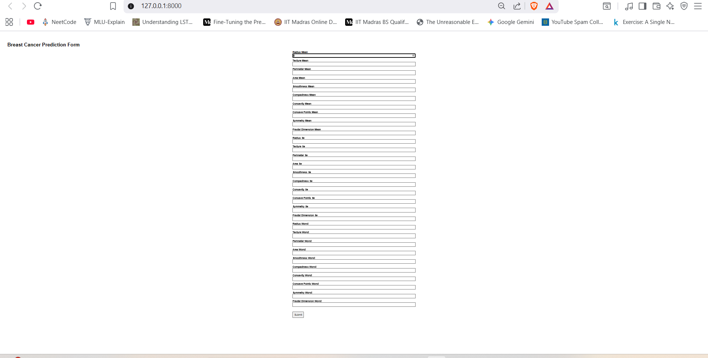
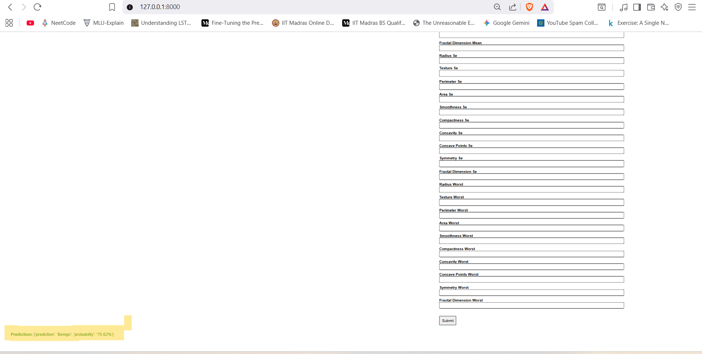
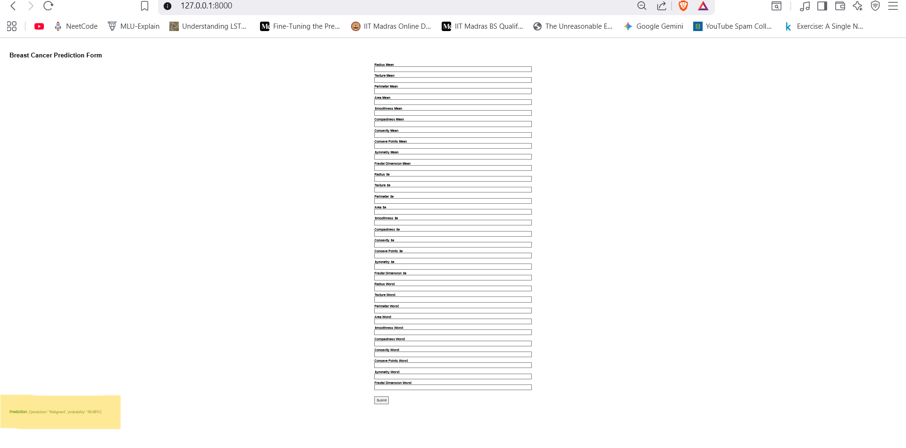

##  Breast Cancer Classification Web App

A clinical-grade, end-to-end machine learning solution that classifies breast cancer tumors as benign or malignant using ensemble modeling techniques and a user-friendly web interface.

###  Project Highlights
- **Full ML pipeline**: data preprocessing with SMOTE, standard scaling, PCA; model tuning via RandomizedSearchCV; ensemble classification.
- **High accuracy & reliability**: Fine-tuned for optimized performance—solid results supporting diagnostic confidence.
- **Production-ready deployment**: Flask-based web app, containerized via Docker, CI/CD enabled on AWS for seamless updates.

###  Evaluation Metrics
- **Accuracy**: *[96%]*  

**Classification Report**  
| Class | Precision | Recall | F1-Score | Support |
|-------|-----------|--------|----------|---------|
| 0 (Benign)  | 0.97 | 0.97 | 0.97 | 71 |
| 1 (Malignant) | 0.95 | 0.95 | 0.95 | 43 |

**Accuracy**: 0.96  
**Macro Avg**: Precision: 0.96, Recall: 0.96, F1-score: 0.96  
**Weighted Avg**: Precision: 0.96, Recall: 0.96, F1-score: 0.96  

---

###  Tech Stack
| Component            | Technology Used         |
|---------------------|--------------------------|
| Language            | Python 3.10.10               |
| ML Tools            | scikit-learn (SMOTE, PCA, RandomizedSearchCV, Voting Ensemble) |
| Web Framework       | Flask                    |
| Containerization    | Docker                   |
| Deployment          | AWS (CI/CD pipeline)     |
| Visualization       | Seaborn, Matplotlib      |
| Version Control     | GitHub                   |

###  Features
- Intuitive UI for uploading tumor data and receiving predictions.
- Modular architecture for easy maintenance and scalability.
- Incorporates **balanced resampling** (via SMOTE), dimensionality reduction, and ensemble learning for trustworthy outputs.

###  Project Demo
| Interface | Prediction bengin | Prediction Malignant |
|-----------|-------------------|-----------------------|
|  |  |  |

##  Future Improvements
- **Optimize model accuracy and latency** with transfer learning or neural network techniques.  
- **Containerize with Docker Compose** for multi-service orchestration.  
- **Introduce MLOps pipelines** for model versioning, monitoring, and automatic deployment.  

## 🧪 Sample Test Data

You can use the following sample rows to test the prediction web app:

| id       | diagnosis | radius_mean | texture_mean | perimeter_mean | area_mean | smoothness_mean | compactness_mean | concavity_mean | concave points_mean | symmetry_mean | fractal_dimension_mean | radius_se | texture_se | perimeter_se | area_se | smoothness_se | compactness_se | concavity_se | concave points_se | symmetry_se | fractal_dimension_se | radius_worst | texture_worst | perimeter_worst | area_worst | smoothness_worst | compactness_worst | concavity_worst | concave points_worst | symmetry_worst | fractal_dimension_worst |
|----------|-----------|-------------|-------------|----------------|-----------|-----------------|-----------------|---------------|--------------------|--------------|-----------------------|-----------|-----------|--------------|---------|----------------|----------------|--------------|------------------|-------------|--------------------|--------------|--------------|-----------------|-----------|-----------------|------------------|----------------|---------------------|----------------|-----------------------|
| 849014   | M         | 19.81       | 22.15       | 130.00         | 1260.00   | 0.09831         | 0.10270         | 0.14790       | 0.09498            | 0.15820      | 0.05395               | 0.7582    | 1.017     | 5.865        | 112.4   | 0.006494       | 0.01893        | 0.03391      | 0.01521          | 0.01356     | 0.001997           | 27.32        | 30.88        | 186.8           | 2398.0    | 0.1512          | 0.3150           | 0.5372         | 0.2388              | 0.2768         | 0.07615                |
| 8510426  | B         | 13.54       | 14.36       | 87.46          | 566.3     | 0.09779         | 0.08129         | 0.06664       | 0.04781            | 0.18850      | 0.05766               | 0.2699    | 0.7886    | 2.058        | 23.56   | 0.008462       | 0.01460        | 0.02387      | 0.01315          | 0.01980     | 0.002300           | 15.11        | 19.26        | 99.7            | 711.2     | 0.1440          | 0.1773           | 0.2390         | 0.1288              | 0.2977         | 0.07259                |


> **Note:** Geometric features (radius, perimeter, area) are measured in **pixels/pixels²** based on digitized FNA images, not mm/mm². All other features are **unitless** ratios/statistics.

---

💡 **How to use:**  
Copy one row (without the `diagnosis` column, since that's the label) and paste the feature values into the web app form to get a prediction.


###  How to Run Locally
```bash
git clone https://github.com/kartheek2003/breast_cancer.git
cd breast_cancer
pip install -r requirements.txt
python app.py
Open your browser at http://127.0.0.1:8000 to interact with the app.

## 🤝 Contributing  

Contributions are welcome!  
Feel free to **fork** this repository and create a **pull request** with your improvements.  

## ✨ Author  

**Kartheek Akkabathula**  
[GitHub](https://github.com/kartheek2003)  
